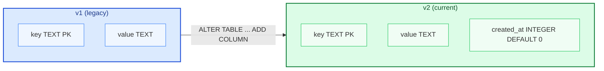
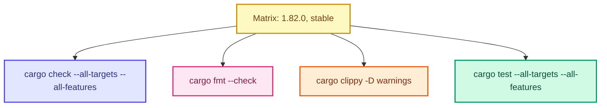

# kvstore-rs

SQLite-backed key/value storage in Rust: **v1->v2 migration**, forward and reverse compatibility tests, and CI on MSRV plus stable.

## What it does

- **`init_v2`** - ensures table `kv` with `key`, `value`, `created_at`; migrates legacy v1 tables (adds `created_at` default `0`).
- **`set_value` / `get_entry`** - upsert and read; missing keys return `KvError::NotFound`.

## Run

Build and run the default binary:

```bash
cargo run
```

Creates `kvstore.db` in the working directory, prints `Hello, world!`, then writes and reads a sample key.

## Example

Library usage:

```rust
use kvstore_rs::store;
use rusqlite::Connection;

fn main() -> Result<(), store::KvError> {
    let conn = Connection::open("kvstore.db")?;
    store::init_v2(&conn)?;
    store::set_value(&conn, "key", "value")?;
    let entry = store::get_entry(&conn, "key")?;
    println!("{} (created_at={})", entry.value, entry.created_at);
    Ok(())
}
```

## Schema and migration



Legacy readers can keep using `SELECT value FROM kv WHERE key = ?`; new code should call `init_v2` first so existing databases get the new column.

## Project layout

| Path | Role |
|------|------|
| `src/lib.rs` | Exposes `store`. |
| `src/store.rs` | Schema, migration, API, unit tests. |
| `src/main.rs` | Sample binary. |
| `tests/compatibility.rs` | v1 data -> `init_v2` -> read. |
| `tests/reverse_compatibility.rs` | v2 write -> v1-style SQL read. |

## Tests

- Unit: v2 roundtrip; missing key -> `NotFound`.
- Integration: forward (v1->v2) and reverse (v2 data readable with v1-shaped queries).

```bash
cargo test --all-targets --all-features
```

## Minimum supported Rust version

**1.82** (`Cargo.toml` `rust-version`), aligned with CI and dependency/toolchain constraints (not an arbitrary pin).

## Continuous integration

On every **push** and **pull request**, a matrix runs **1.82.0** and **stable**:



**Signed commits** (separate workflow): on **pull requests** and **pushes to `main`**, verifies non-bot commits via the GitHub API (`commit.verification`); failures list short SHAs and reasons.

## License

Licensed under the **MIT License**. See [`LICENSE`](LICENSE). SPDX: `MIT`.
